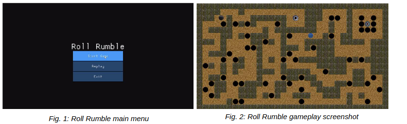
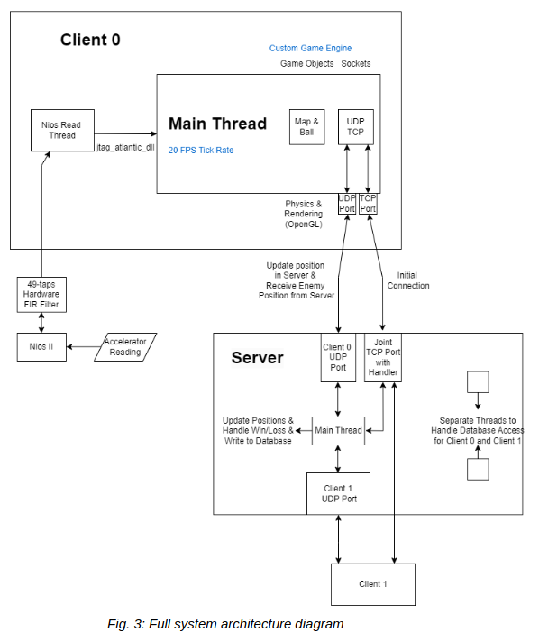
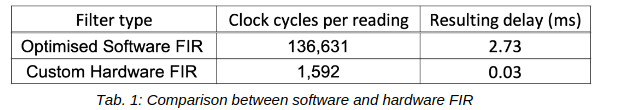
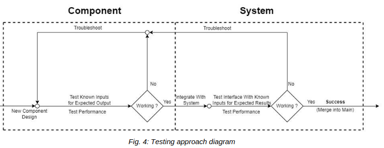

# Roll Rumble - Online Multiplayer Game

Developed as part of "Information Processing" course at Imperial College London
together with Orlan Forshaw, Petr Olšan, Morgan Pressman, Ryan Voecks, and Noam Weitzman.

## Introduction

Our project is an online multiplayer game called Roll Rumble, played by two PC clients connected to
a single AWS server. The DE10-Lite FPGA is used as a game controller, with the accelerometer and
onboard Nios II processor providing tilt control inputs.

All the software for the client and server is written from scratch in C++. The only external libraries
used are JTAG Atlantic and OpenGL, for communicating with the Nios II and rendering the game
respectively. The DE10-Lite has a 49-tap finite impulse response (FIR) lowpass hardware filter for
accelerometer data and uses C software for sending data to the client.

During the game, shown in Fig. 2 below, players race in real-time to roll their ball from a starting
position to the exit. A player’s velocity is controlled by how far, and in which direction, they tilt their
controller. Falling in a hole resets the player’s position.

In addition to live gameplay, the server records all games and stores them in a custom database.
Clients can watch these replays any time after the game, and two clients can watch the same or
different replays simultaneously thanks to multithreading on the server.

The entire system, across the client, server, and FPGA, is optimized for low latency and reliability, to
ensure a smooth and responsive gameplay experience.

## System architecture

The system architecture is shown in Fig. 3 above. The system consists of two PC clients, an AWS
server, and a DE10-Lite FPGA connected to each client. The DE10-Lite has an onboard
accelerometer, 49-tap FIR hardware filter, and NIOS II processor. It takes readings, filters the data,
and sends it to the client at a rate of 1 kHz.

During gameplay, the client calculates frames at 20 FPS. For each frame, the ball’s position is
calculated using the input data, which is read by a separate thread. This position is sent to the server,
from which the client receives the opponent’s position. Finally, the frame is rendered using OpenGL.
Live gameplay communication between the server and clients is done using UDP.

On the server, as each position is received from a client, it is checked against the win condition, and
sent to the other client. The position data is then stored in a database. The server has two additional
threads for allowing clients to watch replays simultaneously. TCP is used to establish an initial
connection between the clients and server, as well as send replay requests and data.

## Design decisions

Hardware filtering: The system uses a custom hardware FIR filter, which is connected to Nios II
using PIO. This allows all the multiplications and additions to happen in parallel, as opposed to
software filtering, where all arithmetic occurs sequentially. To make this work we utilized the following
resources from Quartus: Nios II/e softcore processor, JTAG UART, SPI accelerometer, PIO, clock,
On-Chip RAM memory and timer components.

Controller polling rate: The custom FIR hardware filter makes the FPGA data processing very fast.
To take advantage of this speed, the client is set to poll the controller at 1 kHz. This equates to an
average latency of 0.5 ms and is equivalent to a modern gaming controller.

C++ from scratch: We wrote as much code as possible from scratch using only C/C++ for two
reasons. Firstly, not using more abstract languages provides us with a more detailed picture of how
everything works and allows finer tuning. We also avoid overhead from game engines and exploit the
fast speed of C++. This is crucial for achieving lower latency and a smooth gaming experience.

CMake: CMake is used to compile the code on the Windows client and the Linux server because of
its cross-platform capabilities. This leads to reduced code duplication.

OpenGL libraries: The custom graphics are written using OpenGL libraries. To open an OpenGL
context, the GLFW library was used because it provides platform independent functions for creating
a context. Accessing the OpenGL functions in the graphics card driver requires having headers for
the function definitions and links to the correct functions. This was done with the GLEW library.

OpenGL programming: For the graphics programming a vertex buffer had to be generated for every
shape being drawn. Additionally, two shaders in Graphics Library Shader Language (GLSL) are
required: a vertex shader and a fragment shader. A vertex shader transforms the specified
coordinates into coordinates OpenGL can process using linear algebra with OpenGL matrices. A
fragment shader draws the part of the texture specified in the vertex buffer on the screen between the
given vertex coordinates.

UPD/TCP: Network communication is done using custom UDP and TCP implementations. On the
client this utilises Winsock, and on the server this utilises the UNIX C socket library. UDP is used for
sending gameplay data in real-time to minimise latency. TCP is used for initiating connections, and
requesting and sending replay data, because reliability is more important than latency for these
applications. The UDP requests are non-blocking to minimise the impact of packet loss, and the TCP
requests are blocking to ensure that both clients are connected before the game can begin.

Client identification: To communicate with both clients over UDP, the server needs to use separate
ports. This means that a custom protocol is required for identifying each client and assigning them a
port on the server. This is done when the TCP connection is initiated.

20 FPS lock: Locking the frame rate has two benefits: simplifying physics calculations and reducing
the load on the server. Physics calculations use a constant frame time for updating positions. Since

the client updates the server with its position on each frame, limiting the framerate reduces the UDP
packet loss ratio. The game uses a frame rate of 20 as this is enough for the motion of the balls to
appear smooth, while having an extremely low packet loss ratio.

Server processing: Most online multiplayer games have a fixed rate at which they update the server-
side game state and send updates to the client, which helps to reduce the load on the server. The
server processes client packets as soon as they are received, then immediately updates the other
client. This is more efficient for the game because it reduces latency, and since there are only two
clients overloading the server is not a concern.

Database: The database is a lightweight fully custom design optimised for fast read and write access.
The database provides read and write access to specific files using game ID as a key, and tracks the
number of games played, storing replay data for each. The data is stored in JSON files to optimise
access time.

Server multithreading: The server uses two additional threads to allow both clients to watch replays
at the same time without bottlenecking. The database is designed to have thread-safe reads so that
both clients can watch the same or different replays at the same time.

## Performance metrics

The implementation of the custom hardware FIR filter was compared against an optimised software
implementation. Tab. 1 presents an average of 3000 measurements for both implementations.

The resulting delay was calculated for a 50 MHz clock speed. As can be seen from Tab. 1, the custom
FIR filter is 86 times faster than the already optimised software implementation. This makes the delay
from the FPGA controller effectively negligible.

The following four performance metrics are key to the system:

- The average input latency, between moving the controller, and the ball moving on the screen.
    This strongly affects the perceived responsiveness of the game to the player and therefore
    minimizing it is very important. The input latency was measured to be 138 ms.
- The number of frames rendered by the gamer per second. A high FPS is important for humans
    interpret smooth motion of the balls. For testing the client frame rate was set to 20 FPS.
- The average round-trip time (RTT) over UDP packets between the client and server. Low RTT
    results in a more responsive multiplayer experience. This was measured to 6.6 ms.
- The average UDP packet loss ratio. A high packet loss ratio means the position of the
    opponent is not updated for some frames leading to apparent teleporting. Additionally, it
    makes the replays appear less smooth, as lost packets are not recorded into the database.
    The average UDP packet loss ratio was measured to be 0.02%.

## Testing

Testing for our project was split into two main parts: system-level testing and component-level testing.
After designing each component, it was first tested at the component-level by checking known inputs
against expected outputs. Once these were successful, the component was integrated into another
subsystem, which was then tested similarly. Finally, the subsystems were integrated together to form
the full system. Fig. 4 shows this testing approach diagrammatically.

As well as testing the functionality and reliability of components, performance was tested and
optimized to reduce latency as much as possible. This involved taking performance metrics and
ensuring that they met high standards.

Each interface between two components was tested by sending some known data from one
component to the other, then ensuring that the data received was correct. Where possible, the data
was then sent back and checked for correctness again.

Additionally, whenever a component was updated, its functionality was tested against that of the
previous model to ensure that it was working correctly and understand any differences.

Once the game was in a near-finished state, as many edge cases as possible were tested to verify
that they functioned correctly. Some examples of these are as follows:

- Preventing one client from loading the game menu before the other is connected.
- Having both players win the game at the same time (the server arbitrates).
- Having both players watch the same replay simultaneously
- Having both players watch different replays simultaneously
- Extensive collisions testing between the ball and the walls

Finally, the game was tested through repeated playing to spot and fix unfound glitches.

